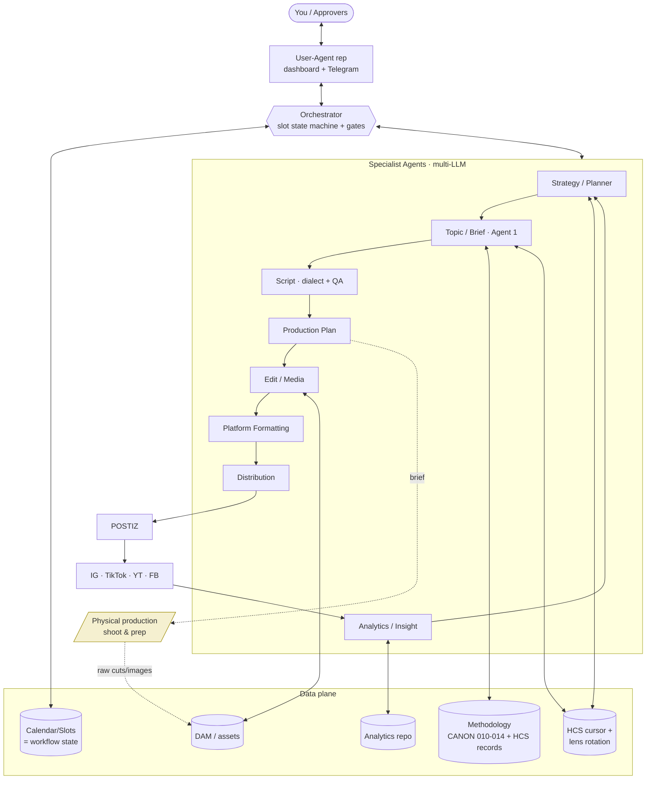

# Tanaghom (Tanaghum) — Autonomous Content Department
## Architecture Blueprint & Tooling Assessment (v2)

**Prepared for:** Khal (Stitch AI / Taatheer Invest)
**Principal/brand:** Moataz Mashal · Tanaghum Academy
**Date:** 28 June 2026
**Supersedes:** v1. Now incorporates CANON-010→015 (pillars, HCS, lenses, hooks, formats, 28-day calendar) and public persona context.

---

## 0. How to read this document
Two things at once: a **decision document** for you (verdict, recommendation, roadmap — Sections 1, 8, 9) and a **build spec** your AI coding agents implement from (Sections 3–7). The methodology engine (Section 5) is now **production-ready in structure**; the only remaining dependency is *data* (filled HCS records), not architecture.

---

## 1. Feasibility verdict

**Yes — buildable, and the methodology is unusually well-suited to automation.**

The system is a **pipeline of specialist agent stages joined by a shared state store and human approval gates.** What makes *your* case strong:

- **The no-repetition problem is already solved by your canon.** CANON-015 specifies a *deterministic, sequential* assignment engine (HCS cursor + lens rotation). This is more robust than the semantic de-duplication I assumed in v1 — uniqueness is guaranteed by construction, not by similarity scoring.
- **Your `Calendar Slot Status` enum is, in effect, the workflow state machine.** The orchestrator and your canon already agree on the lifecycle. That alignment removes a whole class of design risk.
- **Low volume** (2 posts/day, 56 per 28-day round) means infrastructure is cheap; the engineering effort is in the agent quality and the approval flow, not in scale.
- **You build via AI coding agents**, so custom code is low-cost — widening tooling options beyond low-code.

**The hard part remains the approval orchestration** (per-item + per-batch, partial approval, multiple approvers, fixed + ad-hoc, long waits) — and the **quality of Arabic/Palestinian-dialect generation in Moataz's voice.** Both are addressable; both are where to concentrate effort.

---

## 2. Confirmed parameters

| Parameter | Decision |
|---|---|
| Immediate deliverable | (1) Blueprint + tooling assessment; (4) validate workflow + methodology mapping |
| Orchestration | Recommendation in §7 (hybrid, code-first) |
| Methodology | CANON-010→015 received; HCS records seeded provisionally (separate file), awaiting validation |
| Operators | Non-technical team; build driven by Khal via AI coding agents |
| Cadence | 2 posts/day at **09:00 and 20:00 UAE**; **56 posts / 28-day round**; 14 posts/week |
| Calendar | 28-day model is the **default template, provisional** → engine must be **parametric** (other periods + ad-hoc) |
| Platforms v1 | Instagram, TikTok, YouTube, Facebook (Moataz active on all four); X/LinkedIn optional-early; defer rest |
| Language | Arabic **Palestinian dialect** throughout (+ EN where needed) |
| Approval surface | Web dashboard with conversational User-Agent rep + Telegram bot; later the user's own AI client app |
| Cost posture | Per-stage mix, leaning quality/speed on generation stages |
| Distribution | POSTIZ; (Tanaghum app exists — possible future channel) |
| Hosting/residency | UAE-licensed entity → **confirm any data-residency preference** before locking infra (open question) |

---

## 3. Brand & persona context (drives voice)

Moataz Mashal — "strategist for extending life and business"; ex-banking → 12+ years CEO of Al Baraka Holding (20+ companies, 8 sectors, 8,000+ staff); founder/CEO of **Taatheer for Investment** (media, talent development, strategic consulting, fitness/health, hospitality); bestselling author of **صغّر عقلك**; father of three, triathlete, endurance rider; UAE-based; audience = global Arabic. Hub brand: **Tanaghum** (academy + mobile app, iOS/Android).

**Voice signature** = the methodology made personal: *behavioural science + practical systems + Islamic grounding + lived executive/personal experience.* This is exactly why the canon carries `islamic_anchor`, "scientific truth," and P5 (relationship with Allah). Any generated content must sound like one experienced man talking to one person — never like a brand broadcasting.

---

## 4. Target architecture (mapped to your diagram)

### 4.1 Control plane
- **Orchestrator** *[Main agent / Orchestrator]* — owns the slot/workflow state machine, gates, routing, retries, audit. No creative work.
- **User-Agent rep** *[User AI Agent]* — conversational front door (dashboard + Telegram). Translates your intent into orchestrator commands, brings approvals to you. Later swappable for your own agent via API/MCP.

### 4.2 Specialist agents (multi-LLM — your A–E / 1–2)
| Agent | Job | Maps to canon | Model class |
|---|---|---|---|
| **Strategy/Planner** | Build the calendar for a period: pillar distribution, format distribution, HCS cursor, lens rotation. | CANON-015 rules | Reasoning model |
| **Topic/Brief (your "Agent 1")** | Per slot: confirm HCS + select lens + select format + generate topic angle + hook; or flag `NEEDS_STRATEGIC_CLARIFICATION`. | CANON-011/012/013/014 rules | Frontier + strong Arabic |
| **Script Agent** | Write the script in Palestinian dialect; enforce the Mandatory Delivery Check + Hook rules. | CANON-012 §Delivery, 013 | Frontier + dialect |
| **Production-Plan Agent** | Approved scripts → shoot/asset briefs per format. | CANON-014 production notes | Mid-tier |
| **Edit/Media Agents** | Multiple edit options: Remotion video, images/carousels, transcription, B-roll, music. | — | Mixed (tools+models) |
| **Platform-Formatting Agent** | Per-platform variants (aspect, length, captions). | — | Mid-tier + rules |
| **Distribution Agent** | Schedule/push via POSTIZ at 09:00/20:00 UAE. | CANON-015 times | Thin wrapper |
| **Analytics/Insight Agent** | Performance + competitor data → Strategy. | — | Mid-tier + data |

### 4.3 Data plane
- **Calendar/Slot store** — slots keyed `R{round}-D{day}-{AM|PM}`, carrying pillar/format/hcs/lens/status (CANON-015 schema). *This is also the workflow state.*
- **Methodology store** — CANON-010→014 as queryable data + the **HCS records** (the substance; seeded now, validated later).
- **HCS cursor + lens-rotation ledger** — tracks the sequential position and which lens each HCS has used, per round. The no-repeat guarantee.
- **DAM / Smart Digital Assets** — raw cuts, edits, images, music, B-roll, finals; linked to slot/HCS.
- **Analytics Repo** — historical/current/projected KPIs + competitor profiles.

### 4.4 Diagram

---

## 5. The methodology engine (now production-ready in structure)

### 5.1 The deterministic no-repeat engine (from CANON-015)
This is the heart of the system, and it's elegant:

1. **Pillar distribution per round:** P1=22, P2=17, P3=9, P4=4, P5=4 (=56). Fixed.
2. **Format distribution per week:** Studio 4, Event Cut 1, iPhone 2, Podcast 2, Carousel 3, Pic+Caption 1, 3sec+Caption 1 (=14). Fixed.
3. **HCS assignment:** sequential, top-to-bottom within each pillar; the cursor **carries across rounds**; when all 42 are covered, it **restarts at 1.1 with a different lens**.
4. **Lens rotation:** the lens used for an HCS in one cycle **must not repeat** in the next cycle for that HCS.
5. **What varies, what's locked:** keep structure + distributions; vary only HCS assignment, lens, angle, hook, script (CANON-015 Replication Rule).

**Uniqueness key = `HCS × Lens × angle`.** Because the cursor + lens-rotation are deterministic, repetition is prevented *by construction*. Semantic similarity check is demoted to a **secondary safety net** (catches accidental angle/hook echoes), not the primary mechanism.

> Golden Formula (CANON-012): `42 HCS × 5 lenses = 210 pieces/round-set`; two cycles/year ≈ 420 non-repeating pieces.

### 5.2 Parametric calendar (handles "provisional / other periods / ad-hoc")
The 28-day model is the **default template**. The engine treats a calendar as parameters: `{period_length, posts_per_day, post_times, pillar_distribution, format_distribution}`. This lets you run a different period or inject **ad-hoc slots** (status `RESERVED`) without breaking the cursor — ad-hoc items can either consume the cursor or be marked off-cycle.

### 5.3 Slot lifecycle = workflow + approval state
Your CANON-015 enum *is* the gate model:
`EMPTY → RESERVED → DRAFT_ASSIGNED → APPROVED_ASSIGNED → SCHEDULED → PUBLISHED`, with `SKIPPED` / `REPLACED` as branches.
- **DRAFT_ASSIGNED → APPROVED_ASSIGNED** = the topic/brief/script approval gate (per-item or per-batch, multi-approver, fixed/ad-hoc).
- **REPLACED** = the "request change / reject" branch (re-assign HCS/lens or rework).
- Media stages add sub-states under the slot (e.g., `EDIT_OPTIONS_READY → EDIT_APPROVED`).

### 5.4 HCS records (the substance)
CANON-011's record fields (`core_wound, false_belief, earthquake_sentence, islamic_anchor, name_ar`, …) are the only empty piece. They are **seeded provisionally** in `HCS_Seed_Records_GoldSet_v1.md` (5 records, one per pillar) pending your validation, then expanded to all 42. **Engine is complete without them; output quality depends on them.**

### 5.5 Generation rules baked into agents
- **Topic/Brief (Agent 1):** select lens per CANON-012 viewer-state; pick default hook type per lens (override allowed); pick format per CANON-014 (HCS + lens + platform + calendar — not preference); else `NEEDS_STRATEGIC_CLARIFICATION`.
- **Script Agent hard gates** (auto-reject before human sees it):
  - Hook rules (CANON-013): first line 3–7 words; no greeting; no Moataz's name; address one person; true not merely clever.
  - Mandatory Delivery Check (CANON-012): scroll-stopping hook, full emotional journey, metaphor, scientific truth, Qur'an/Hadith *when organic*, light human moment, unforgettable final line.
  - `islamic_anchor` content flagged for scholar verification; dialect flagged for native review.

---

## 6. Per-stage tooling & model recommendations
| Stage | Tooling | Notes |
|---|---|---|
| Planner / Topic / Script | Frontier LLM with strong **Arabic + Palestinian dialect**; embeddings for the safety-net dedup | Voice is the brand. Keep a native-dialect reviewer in early gates; feed corrections back as few-shot examples. |
| Cursor + calendar + slots | Postgres (slots, cursor, lens-rotation, audit) | Same DB hosts the safety-net vector index (pgvector). |
| Video edits | **Remotion** primary (code → fits your build model) + AI video/B-roll | Generate multiple options per slot cheaply. |
| Images / carousels | Canva/Pencil/SuperDesign + ImageMagick for templated bulk | Carousel slide 1 must stand alone as a Reel hook (CANON-014). |
| Transcription (Palestinian) | Arabic-dialect ASR + human spot-check | Dialect ASR is imperfect early. |
| Music / B-roll | AI music + DAM stock library | Tag for reuse. |
| Distribution | **POSTIZ** API; schedule 09:00/20:00 UAE | Distribution Agent = thin wrapper. |
| Analytics + competitors | Platform APIs + competitor insight tool | Feeds Analytics Repo → Planner. |
| Approval surface | Web dashboard (chat-first) + Telegram bot | Telegram for on-the-go approve/reject; dashboard for batch review + asset preview. |

---

## 7. Tooling assessment: n8n vs code vs hybrid

| Need | n8n | Code (durable engine) | Hybrid |
|---|---|---|---|
| Connectors / scheduling / simple automation | ★★★ | ★★ | ★★★ |
| LLM chains / agents | ★★ | ★★★ | ★★★ |
| **Long-running approvals (resume after days)** | ★ | ★★★ | ★★★ |
| **Per-item + per-batch partial approval, branching** | ★ | ★★★ | ★★★ |
| **Multiple approvers, fixed + ad-hoc gates** | ★ | ★★★ | ★★★ |
| Deterministic cursor/lens engine + audit | ★★ | ★★★ | ★★★ |
| Conversational User-Agent rep | ★ | ★★★ | ★★★ |
| Remotion / media pipelines | ★ | ★★★ | ★★★ |
| Non-technical operators | ★★★ | ★ (needs built UI) | ★★ |
| Built by AI coding agents | ★★ | ★★★ | ★★★ |

### Recommendation: **Hybrid, code-first.**
- **Backbone in code:** a durable workflow engine (e.g., **Temporal** or **Inngest**) for resumable, approval-gated, long-running flows + an agent framework (e.g., **LangGraph**) for reasoning. The slot lifecycle, cursor, and multi-approver gates need this rigor; n8n gets fragile here.
- **n8n as the glue layer:** connectors, POSTIZ push, scheduled triggers, Telegram wiring, notifications — visible/editable automations for the easy stuff.
- **Operators never touch code** — they live in the chat-first dashboard + Telegram; complexity hides behind the User-Agent rep.

### Pragmatic path
The **MVP doesn't need Temporal yet.** Start with: one orchestrator service + Postgres (slots/cursor/lens + pgvector) + a simple Next.js dashboard + Telegram bot + Planner/Topic/Script agents. Add the durable engine in Phase 2 when branching/approval complexity demands it. Don't pay architecture tax before the loop works.

---

## 8. Phased roadmap

- **Phase 0 — Foundations (now):** canon ingested; HCS records seeded; data model + stack locked. *Output: this v2 + seed records.*
- **Phase 1 — Vertical slice (recommended first build):** Planner builds a 28-day calendar → Topic/Brief (Agent 1) → Script (with QA gates) → one batch approval gate with partial approval → slots reach `APPROVED_ASSIGNED`. Includes the cursor/lens engine + dashboard + Telegram. **Replaces the most labor-intensive human work and is fully testable against the canon.**
- **Phase 2 — Production handoff + Edits:** briefs → DAM intake of raw cuts → Edit/Media agents (Remotion/images/transcription/music/B-roll) with per-edit/batch gates. Introduce durable orchestrator.
- **Phase 3 — Formatting + Distribution:** platform variants → POSTIZ publish gate → scheduled 09:00/20:00 UAE.
- **Phase 4 — Analytics loop:** performance + competitor intel → Planner; enables methodology-refinement recommendations.

---

## 9. Risks, open questions, and what's next

**Risks**
- **Dialect + voice authenticity** — the top quality risk. Native Palestinian reviewer in early gates; build a few-shot example bank from approved scripts.
- **Religious accuracy** — `islamic_anchor` must be scholar-verified; never auto-publish a Qur'an/Hadith reference unverified.
- **Approval fatigue** — 14 items/week × stages. Default to **batch** approvals with partial actions; reserve per-item gates for high-stakes stages.
- **Physical production is the real bottleneck**, not the AI; plan around shoot availability (Event Cut needs real footage weekly).

**Open questions for you**
1. **HCS seed pattern** — approve/adjust the 5 gold records so I can generate the other 37.
2. **Value-ladder canon** — needed to finalize `value_ladder_relevance` and CTAs (Phase 3).
3. **Agent definitions (Agent 2/3…)** — if they exist, so I reconcile your roster with §4.2.
4. **X + LinkedIn** in v1 or deferred?
5. **Data-residency/hosting** preference (UAE entity) before locking infra.
6. **Gold transcripts** — 3–5 real scripts you consider best, for voice calibration (I can attempt YouTube; pasted transcripts are most reliable).

---
*v2. Sections 1–8 are decided given current inputs. Section 5.4 (HCS substance) finalizes on validation of the seed records.*
