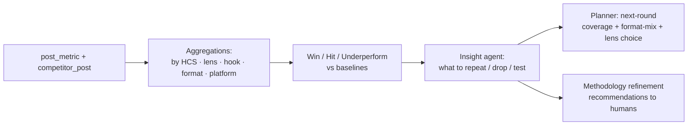

# Analytics Repo — Design & Baselines (v1)

**Role in the system:** the feedback memory. It ingests post performance + competitor data, computes KPIs, and feeds the **Planner/Strategy agent** so the next round leans toward what works (HCS themes, lenses, hooks, formats) and rebalances coverage. Maps to *[Smart Data/Analytics Repo]* in the diagram.

---

## 1. Data model

### 1.1 `content_item` (the canonical join key — one row per produced piece)
Links the methodology to the published reality. Keyed to the calendar slot.

| Field | Type | Source |
|---|---|---|
| `content_id` (PK) | uuid | system |
| `slot_id` | text | calendar (e.g. R1-D01-AM) |
| `hcs_id` | text | CANON-011 |
| `pillar_code` | text | CANON-010 |
| `lens` | text | CANON-012 |
| `hook_type` | text | CANON-013 |
| `format` | text | CANON-014 |
| `topic_angle` | text | Topic agent |
| `script_ref` | text | DAM |
| `language` | text | ar-PS / en |
| `published_at` | timestamptz | distribution |

### 1.2 `post_metric` (one row per platform publication of a content_item)
Normalized across platforms so they're comparable.

| Field | Type | Notes |
|---|---|---|
| `post_id` (PK) | text | platform post id |
| `content_id` (FK) | uuid | join to methodology |
| `platform` | enum | instagram / facebook / tiktok / youtube / x / linkedin |
| `post_type` | text | reel / carousel / image / short / long |
| `duration_sec` | int | |
| `published_at` | timestamptz | |
| `views`, `reach` | bigint | |
| `likes`, `shares`, `comments`, `saves` | bigint | |
| `follows` | bigint | attributed follows |
| `retention_pct` | numeric | YouTube/“avg % viewed”; null elsewhere |
| `stayed_to_watch_pct` | numeric | YouTube |
| `snapshot_at` | timestamptz | for time-series re-pulls |

> The four exports map directly: IG/FB CSV → `post_metric` (+ `Description` → `content_item.topic_angle`/script link); TikTok xlsx → `post_metric`; YouTube `Table data` → `post_metric` with retention fields. Build the ingester to this schema and historical data loads on day one.

### 1.3 `competitor_post` (same shape, flagged external)
For competitor profiles; `is_competitor=true`, plus `competitor_handle`.

### 1.4 Derived metrics (computed, not stored raw)
`engagement = likes+shares+comments+saves` · `ER = engagement/views` · `save_rate = saves/views` · `share_rate = shares/views` · `follow_rate = follows/views`. Share + save are the **distribution/algorithm signals**; ER is the **resonance signal**; retention is the **hold signal**.

---

## 2. Baselines (computed from your exports — these become the targets)

| Metric | Instagram | Facebook | Notes |
|---|---|---|---|
| Median views | 64,674 | 96,234 | per-post typical |
| p75 views | 102,508 | 143,345 | “good” post |
| p90 views | 151,157 | 210,366 | “hit” threshold |
| Median ER | 4.2% | 4.0% | resonance baseline |
| p75 ER | 5.2% | 5.2% | strong resonance |
| Median save-rate | 0.67% | 0.59% | |
| Median share-rate | 0.62% | 0.56% | |
| Attributed follows (period) | 18,528 | 57,162 | growth contribution |

**TikTok:** median ~20K views (discovery channel; judge on view ceiling + share-rate, not median). **YouTube:** judge Shorts on **retention** — top Shorts hold **66–86%**; set a **≥60% retention** target for <60s, and treat <40% as underperformance.

> Recommended scoring: a post is a **Win** ≥ p75 views *and* ≥ p75 ER; **Hit** ≥ p90 views; **Underperform** < median on both. The Planner uses these labels per `hcs_id × lens × hook_type × format` to learn what to repeat.

---

## 3. Feedback loop (how it drives the Planner)

Concretely, each round the Insight agent answers: which **HCS** over/under-perform; which **lens** wins per pillar; which **hook type** drives shares vs saves; which **format** earns reach (carousels currently lead); **best-time** confirmation (vs the 09:00/20:00 default); and **competitor gaps** (themes they win that you don't). These become Planner parameters and human-facing recommendations (it never silently rewrites the canon — it *proposes*).

---

## 4. Build notes
- **Storage:** same Postgres as the workflow/state DB to start (one system to run). Add a small ETL job (n8n or a scheduled script) to pull platform APIs into `post_metric` on a cadence; backfill from the provided exports first.
- **Identity:** `content_id` is the spine — enforce that every published post is tagged back to its slot/HCS/lens/hook/format at distribution time, or the loop is blind. This is the single most important data-discipline rule.
- **Privacy/residency:** aggregate engagement only; no personal data on commenters. Confirm residency before choosing hosting (open question in blueprint §9).

*v1 — baselines reflect the supplied windows (IG Jan–May 2026; FB May 2025–May 2026) and will move as data grows.*
