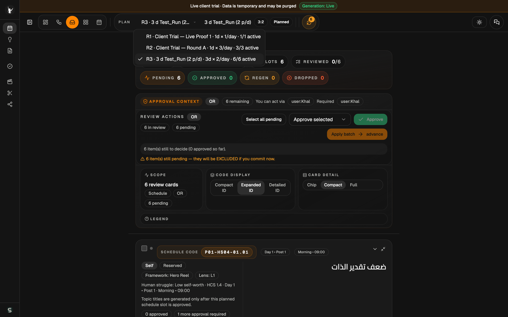
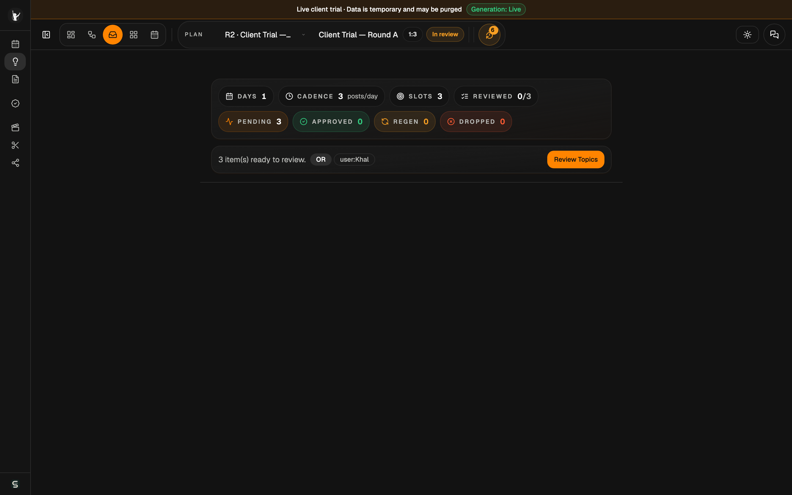
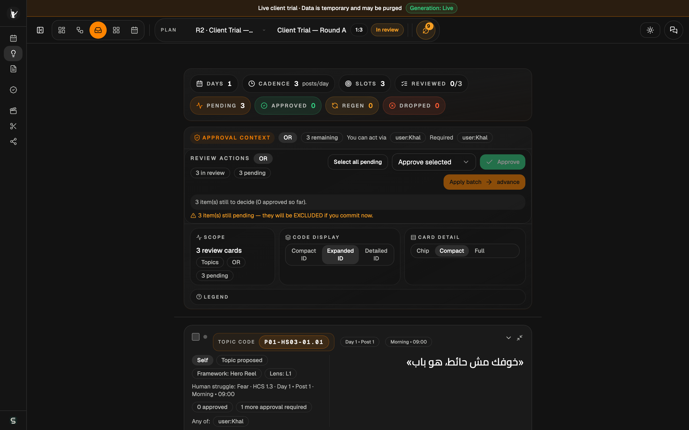
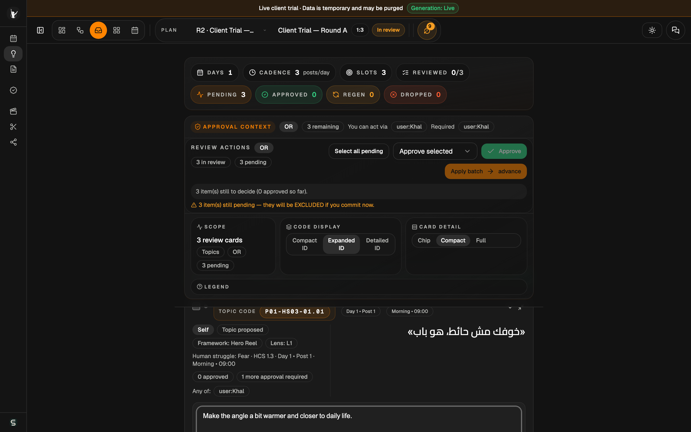
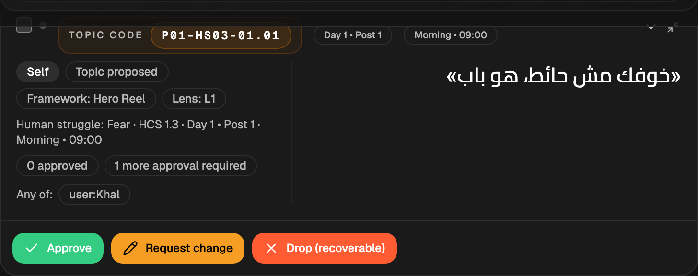

# Tanaghom — Client Reviewer Guide (living source)

*Last reviewed: 2026-07-10 · Release/trial tag: post-trial-2026-07-06 baseline · Maintained per [README.md](README.md)*

This is the **canonical, maintained** client guide. Dated trial exports live under
`artifacts/client-trial-guide/` (a local operator archive, outside git by design) and are never edited. Section anchors below are the stable
consumption points for the in-app tour (#44) and help copilot (#45).

---

## Purpose and scope {#purpose}

Tanaghom plans a content calendar and generates **topics** and **scripts** for review. As the
reviewer, you look at what the system generated, ask for changes, regenerate when needed, and
approve what's good. The review dashboard is the surface for all of this.

## Access and environment {#access}

- **URL and credentials are provided per engagement** — they change between trials/releases and are
  never part of this living guide. (The dated snapshot records what a specific trial used.)
- **Browser:** recent **Chrome** or **Edge** on a desktop/laptop.
- In trial environments, a banner at the top reminds you the environment is live and temporary:

*Top banner — live-trial notice and the green "Generation: Live" indicator.*

Trial environments additionally mean: generation is live (not canned), data may be reset or purged,
and confidential/production data must not be entered unless explicitly approved.

## What you can do {#capabilities}

- **View rounds** — pick a content run from the selector at the top.
- **Inspect generated topics and scripts** — hook, context, and details per item.
- **Request changes** — leave a note asking for a different angle, tone, or wording.
- **Regenerate** — produce a new version that applies your note.
- **Approve** — accept an item so it moves forward.
- **Move through review stages** — Topics → Scripts → later stages, where available.

## Stage-by-stage walkthrough {#walkthrough}

### Open a round {#walkthrough-open}
Use the **round selector** at the top and choose a round to review.

### Enter the review {#walkthrough-enter}
On the Topics stage, click **Review Topics** to load the review cards (later stages read "Review
Scripts", etc.). The status summary shows days/cadence/slots plus Reviewed, Pending, Approved:

### Review the cards {#walkthrough-review}

### Request a change {#walkthrough-request}
Click **Request change** on a card, type what you'd like different, and submit.

*Leave a short, specific note — e.g. "make the angle warmer and closer to daily life."*

### Regenerate {#walkthrough-regenerate}
After asking for a change, use **Regenerate (apply my comments)**. It takes a few seconds; a
progress indicator shows it working.

### Approve {#walkthrough-approve}
Click **Approve** on a card you're happy with — it's confirmed immediately and moves forward.
("Restore" is available if you change your mind while the item is still shown.)

### Move to the next stage {#walkthrough-next}
When a stage has nothing left to review, the dashboard offers a **"Review complete · Next: …"**
forward button.

### Review scripts {#walkthrough-scripts}
The **Scripts** stage works the same way — each card leads with the script's own opening line, and
you can request changes, regenerate, and approve.

> *screenshot refresh pending — a script-stage capture is still owed (carried over from the
> 2026-07-06 trial snapshot); the flow mirrors the Topics stage.*

## Card anatomy {#card-anatomy}

*Left: content code, day/time, framework, lens, human-struggle context. Right: the generated hook.
Bottom: the actions.*

- **Content code** (e.g. `P01-HS03-01.01`) — a stable identifier for the slot.
- **Framework / Lens** — the content format and angle the system chose.
- **Human struggle** — the audience need the topic addresses.
- **Hook** — the generated headline/opening line.
- Script cards additionally show the structured beat flow, delivery direction, the generation
  **target** (e.g. Arabic — Palestinian dialect), model attribution where recorded, and a
  "marked for native review" flag where set.

> *screenshot refresh pending — the card surface has evolved since the 2026-07-06 captures
> (structure/model/target/native-review badges); refresh per the README checklist before the next
> client-facing use.*

## Actions reference {#actions}

| Action | What it does |
|---|---|
| **Approve** | Accepts the item; it moves forward immediately. |
| **Request change** | Records your note; the item awaits regeneration. |
| **Regenerate (apply my comments)** | Produces a new version addressing your note. |
| **Drop (recoverable)** | Sets the item aside without deleting it. |
| **Restore** | Brings back a dropped/decided item while still shown. |
| **Rework from version …** | In version history: restores an older version as the working head and regenerates from it. |

## Known limitations {#limitations}

- Trial access is locked to the review surface; operator/admin tools are turned off (methodology
  admin, workflow admin, creating plans/runs, switching reviewer identities, developer/debug
  controls). Opening an admin page returns you to the dashboard — expected:

- Trial data may be reset or purged at any time.
- **Trial outputs are not final production content** — don't publish them.
- You review as a single fixed reviewer identity for now.

## How to judge output quality {#quality}

- **Relevance** — fits the intended audience and pillar?
- **Clarity** — immediately understandable?
- **Tone** — natural and on-brand (Palestinian dialect where used)?
- **Audience fit** — would the target viewer stop and watch/read?
- **Usefulness** — would you actually publish it?
- **Factual / cultural accuracy** — anything wrong, off, or insensitive?
- **Missing nuance** — anything important left out or oversimplified?

## Feedback path {#feedback}

Use the [feedback template](feedback-template.md). Capture usability friction, confusing labels,
content-quality examples (with content codes), bugs (with screenshots), missing features, and slow
or broken flows. Concrete examples are the most useful.

## Support {#support}

- **Contact:** stitch@taatheerinvest.com
- For anything blocking your review, note it in the feedback template and reach out.
