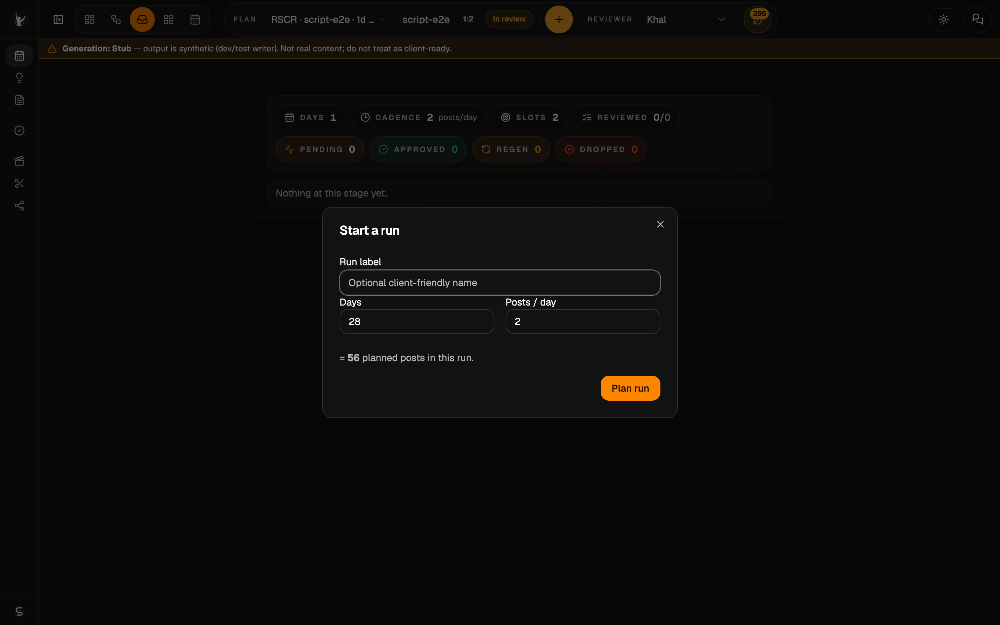
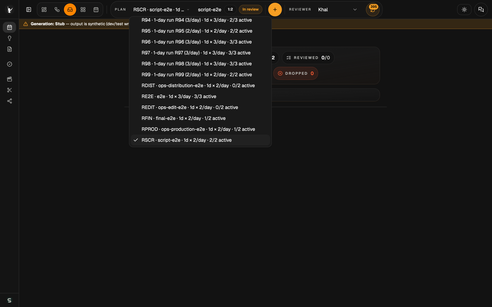
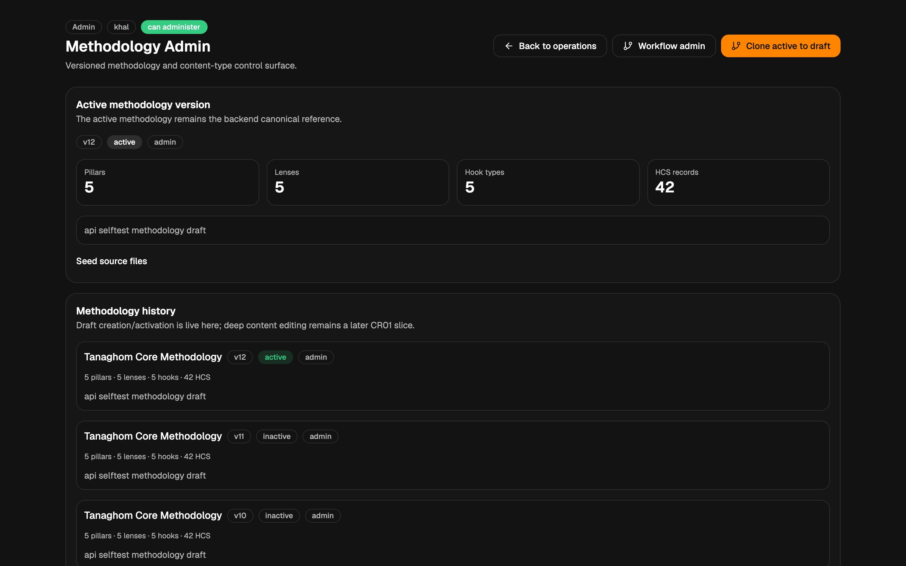
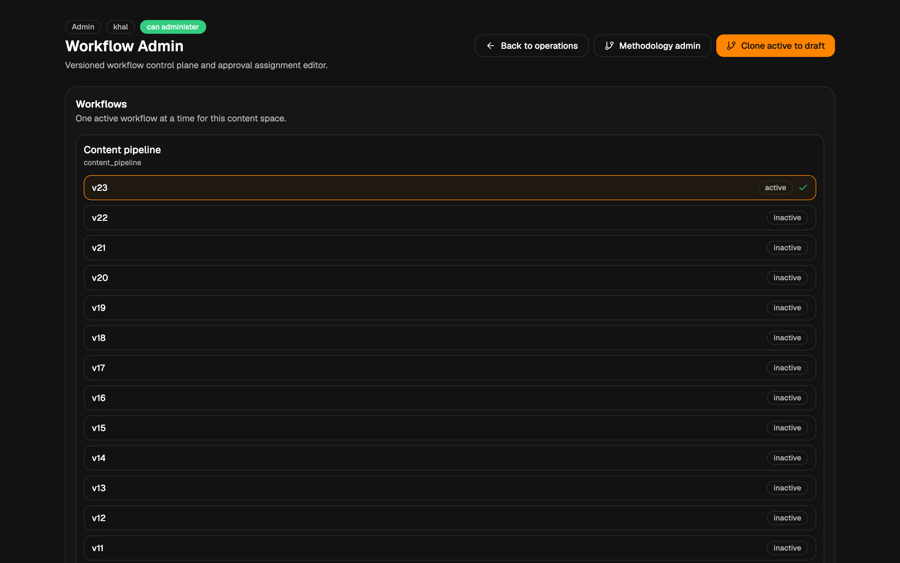

# Tanaghom — Operator & Admin Guide (living source)

> ⚠️ **Internal — operator/admin. Not for clients.** This guide documents the unlocked
> operator/admin surface and must never be shared with, or linked from anything shown to, clients.
> The client-facing guide is maintained separately in [`client-guide.md`](client-guide.md) and does
> not reference this document.

*Last reviewed: 2026-07-10 · Release/trial tag: post-trial-2026-07-06 baseline · Maintained per [README.md](README.md)*

This is the **canonical, maintained** operator/admin guide (#46). Dated operator exports live under
`artifacts/operator-admin-guide/` (a local operator archive, outside git by design) and are never
edited. Operator screenshots use the `op-` prefix under `screenshots/`.

---

## Audience & scope {#audience}

For **operators** (plan runs, review/approve content, monitor progress) and **admins** (manage
methodology and workflow configuration). It covers everything in the client guide plus the
operator/admin controls that are hidden in client-trial mode.

## The surfaces (know which one you're on) {#surfaces}

Three dashboard surfaces exist, distinguished by data set, writer mode, and access level:

| Surface | Data | Access |
|---------|------|--------|
| **Dev / operator dashboard** | full dev data | full operator + admin |
| **Trial operator dashboard** | trial data only | full operator + admin |
| **Client trial dashboard** | trial data only | **locked** (review only) |

Only the client surface blocks admin routes and hides operator controls; the other two are full
operator/admin.

**Deployment state — verify at use time.** Hosts, ports, database names, public links, auth-gate
topology, and credentials are per-deployment facts, not product behavior. They live in the owner's
deployment records (never in this guide) and must be confirmed against the running stack before any
session. Two standing rules regardless of deployment:

- The **client** link is the only one ever given to clients; operator/dev links expose full admin
  and stay private to the owner.
- Public exposure of any surface must sit behind an authentication gate.

## Generation mode — the production-control safeguard {#generation-mode}

Every surface shows the runtime generation mode from the API health endpoint. When generation is
**not live**, an unmissable banner appears so synthetic output is never mistaken for real content:

*Stub mode shows this warning strip. In live mode the strip disappears — its absence is the "live"
signal. Never run a client demo on stub.*

Confirm the mode before any client-facing use: the health endpoint reports
`writer_mode: live | stub`. The preflight `tools/dashboard-health-check.sh` (with `--allow-stub`
where stub is acceptable) gates on this too.

## Operator dashboard tour {#dashboard-tour}

Header: round selector, view/lens switcher, **New run** (planner), **Reviewer** (persona picker),
theme/agent toggles, and the run-funnel strip showing pipeline progress at a glance. Below: the
round's status summary and review controls. Left rail = the pipeline stages
(Schedule → Topics → Scripts → sign-off → production). The lens switcher flips the same data
through Overview / Workflow / Inbox / Grid / Calendar.

> *screenshot refresh pending — the dated operator-dashboard capture predates the header run-funnel
> strip and header re-budget (#134/#136); recapture per the README checklist before relying on it.*

## Creating a run (planner) {#planner}

Click **New run** and set the run size (days × posts/day). The planner scales the calendar and
reserves slots; topics are generated only after the schedule is approved.

*The planner dialog — days and posts/day. Bounds are enforced (days ≤ 366, posts/day ≤ 24).*

## Reviewer identity (persona) {#reviewer-identity}

Operators can act as different reviewer principals. Use the **Reviewer** switcher in the header:

*Pick the acting reviewer. This drives who an approval is attributed to and which assignments you
can satisfy. (Hidden entirely in client-trial mode.)*

**Persona switching is operational identity, not authentication.** There is no login behind the
picker and no real per-user access model yet (tracked in #13). What *is* enforced: sensitive
review/approval decisions are authorized **server-side at decide time** — the API requires a signed
trusted principal and rejects unsigned or mismatched actors, so the persona picker cannot be used
to forge an approval the server would not attribute (#123/#147). Do not present this as a full IAM
or per-user auth system.

## The review flow (operator perspective) {#review-flow}

Per-item actioning is the default; selective **batch** tools are optional acceleration. The
disposition bar shows the live approval context (rule, who can act, remaining), the
staged/committed counts, and the batch commit with an AI advisory. Content stages support
request-change → regenerate (live rework) → approve, with an awaiting-regeneration strip while a
requested change is outstanding, and the stage offers a forward transition when complete.

Script review cards additionally carry the structured beat flow labeled from the content-format
registry, the generation **target** badge, model attribution where recorded, and a
"marked for native review" flag where set (#149/#154/#157).

## Lenses {#lenses}

**Overview** — round-level KPIs and which stages need attention now.

**Workflow** — the pipeline/stage view; from here admins can jump to the workflow admin surface.

> *screenshot refresh pending — the dated overview-lens and workflow-lens captures predate the
> header run-funnel strip and current card badges; recapture per the README checklist.*

## Methodology admin {#methodology-admin}

Manage the content methodology — pillars, human core struggles (HCS), lenses, hook types, content
formats, and content-type/versioning.

*`/admin/methodology` — the methodology control surface. Changes here define what the planner and
writer draw from.*

## Workflow admin {#workflow-admin}

The versioned workflow control plane and approval-assignment editor. One workflow is active per
content space; you clone the active version to a draft, edit stages/gates/assignments, then
activate.

*`/admin/workflows` — "Content pipeline" with its version history (active + inactive). Use
**Clone active to draft** to make changes safely, then activate.*

> Stage identity vs. label: the internal gate ids (e.g. `final_review`) are canonical and stable;
> operator-facing labels are presentation only (see #39). Rename labels here, not the underlying ids.

## Operational notes {#operations}

- **Health / preflight:** `tools/dashboard-health-check.sh` (+ `--allow-stub`, `--fix-tailscale`).
  Green = API + dashboard + exposure path + mobile + Telegram all healthy.
- **Trial stack isolation:** the trial runs on its own database and API instance, fully purgeable
  without touching dev data. Concrete names/ports are deployment state — verify at use time.
- **Purge/reset (trial only):** snapshot the trial database first; then an FK-safe delete scoped to
  the trial data (child rows → topic → slot → round); baseline config (methodology, principals,
  workflow) survives. Never target the shared dev database.
- **External exposure:** surfaces may be exposed publicly behind an auth gate for demos/trials.
  Current links and credentials are deployment state kept in owner-only records — confirm the
  active exposure path and refresh per-engagement facts before each session. Client link only for
  clients.
- **Release gate:** one issue = one branch = one acceptance target; mandatory evidence per change;
  see `docs/16_Release_Gate_and_Delivery_Control.md`.

## Cautions & known limitations {#cautions}

- **Do not run client-facing sessions on stub mode** — the banner is the safeguard, but confirm
  `writer_mode: live` yourself.
- **Admin changes are powerful** — workflow activation and methodology edits affect
  planning/generation immediately. Clone-to-draft and review before activating.
- **The client surface must stay locked** — never hand a client an operator/dev link.
- **Reviewer identity is operational, not authenticated** — decide-time authorization is
  server-enforced (#123/#147), but a real per-user role model is still tracked in #13.
- **Dev data is cluttered** (accumulated test rounds) — the e2e suite regenerates test rounds;
  clean before any demo.

---

*See also: the client guide ([`client-guide.md`](client-guide.md), locked review surface) and the
deferred help-system issues (#44 in-app tour, #45 help copilot; #46 tracks this living-docs
program). This guide is never linked from the client guide.*
